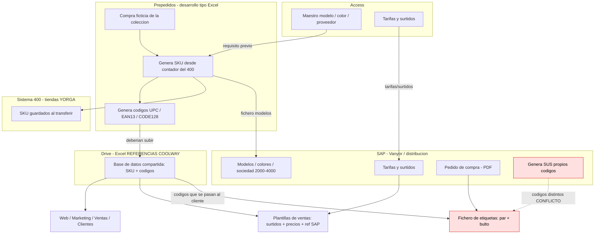
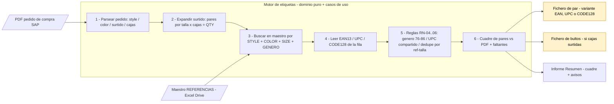
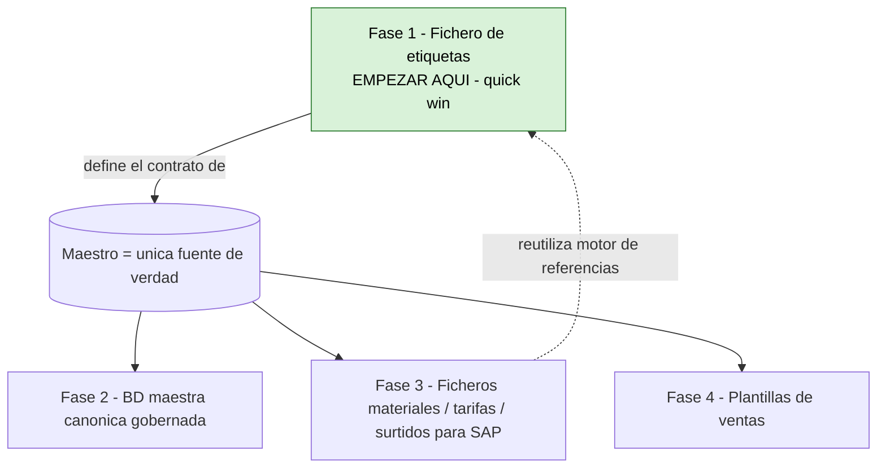

# REQ-001 · Diagramas de flujo

- **Fecha:** 2026-06-08 · **Relacionado:** [`diseño.md`](diseño.md) · [`prd/prd-fase1-etiquetas.md`](prd/prd-fase1-etiquetas.md)
- Diagramas como imagen (se ven en cualquier sitio). El código Mermaid editable está plegado bajo cada uno. 🔴 = punto de dolor actual · 🟡 = pendiente de decidir.

---

## 1. AS-IS — Proceso completo de colección (hoy, manual)

> Silvia hace de "bus de integración humano" entre 4 sistemas que no se hablan. El dolor raíz:
> los códigos de barra los genera Prepedidos **y** SAP por separado → **no cuadran**.

**Dolores marcados:**
- 🔴 SAP regenera códigos ≠ Prepedidos → descuadre.
- 🔴 El fichero de etiquetas hay que comprobarlo a mano, fichero por fichero.

Ver código Mermaid

---

## 2. TO-BE — Motor de fichero de etiquetas (Fase 1)

> El maestro del Drive es la **única autoridad** de códigos: el motor **busca y lee**, nunca inventa.
> Núcleo de dominio puro; los bordes (PDF / Excel / mañana Drive-API) son adapters intercambiables.

🟡 El **layout exacto** del fichero de salida está pendiente de Silvia (**DEP-06**: formato prepedidos rico vs simplificado).

Ver código Mermaid

### Mapeo a la arquitectura hexagonal
| Paso | Capa | Pieza |
|---|---|---|
| Entradas IN1/IN2 | infraestructura (adapters in) | `pdf-order-reader`, `excel-master-reader` |
| P1–P6 | dominio + aplicación | reglas puras + `generate-labels.use-case` |
| Salidas O1–O3 | infraestructura (adapters out) | `excel-label-writer`, `bulto-writer` |

---

## 3. Mapa del epic REQ-001 (4 fases)

> Estrategia (Opción C): la Fase 1 entrega valor ya **y** define el contrato del maestro que necesitan las fases 2-4.

Ver código Mermaid

